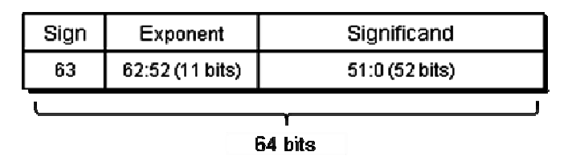

# double precision: subtleties leading to incorrectness


I was solving some entry-level problems on [codewars](https://codewars.com), one of the many resources dedicated to helping programmers practice. There was one very easy problem that I solved in 5 minutes... As it turned out, solution was incorrect, but all the tests passed. :) I got thinking about it and didn't move on for the next couple of hours.

It's stated in the following way:
Given a `long long` integer `N`, write a function, that
- if `N` is a perfect square (meaning there's integer `n` which satisfies `n^2=N`), return `(n+1)^2`
- if `N` is not a perfect square, return `-1`.

Sounds really simple, right? Just as simple as FizzBuzz. But it's actually a bit more complicated than this.

The actual correct solution is not the aim of this article, and it's relatively easy to come up with one once you understand the shortcomings of dirty-and-fast version.

So how would one solve that?

The vast majority, I believe (at least based on what I saw on codewars itself), will come up with something like (let's think c++):

```c++
#include <cmath>

long long f(long long N) {
  double n = std::sqrt(N);
  return (long long)n == n ? (n + 1) * (n + 1) : -1;
}
```

What can possibly go wrong here?

First, let's make a couple of sensible assumptions. `double` and `long long` are both 64-bit wide, and `double` is implemented adhering to [IEEE 754](https://en.wikipedia.org/wiki/IEEE_754) standard.

When in the first line of our function we invoke `std::sqrt(N)`, `N` gets implicitly converted to `double`. Due to how `double` is implemented, it may lead to precision loss.



The number encoded by the standard may be written as `(-1)^s * (2^e) * (1 + m)`, where `s` equals to sign bit value, `e` is encoded by exponent bits and `m` is encoded by significand bits. We're omitting here some special cases such as denormalized and special values like `Inf` and `NaN`, as they're irrelevant to the problem. `m` is encoded as a fractional part of the number with implied 1 before the decimal point, e.g. `10000...000` significand bits encode decimal `1.5`.

Now the question is, what is the largest integer number that may be represented by `double` without loss of precision, with all the integer numbers less than that also may be represented as such?

Let's look at `2^53` (52 bits + 1 leading `1`). It can be stored for sure, all zeroes in significand bits and `e` representing `53`.

What about `2^53+1`? We have `e` still giving us `2^53`, but now we have to add a `1` to the right of significand bits. The thing is, it's not sufficient to have 52 bits for that, we need 53. Intuitive way to think of it is to think of exponent as right shift. Significand bits `00000...000` * `2^53` encodes `2^53`, but to encode `2^53+1`, we don't have enough width available. There's no problem with `2^53+2`, however - the rightmost available bit is sufficient now.

Similarly, all the numbers below `2^53` have sufficient bit width to be encoded without any loss of precision.

Guess now you get the idea: if `N` supplied to our function is greater than `2^53`, we're not guaranteed at all to successfully determine if that's a perfect square or not due to possible precision loss.

But it gets even funnier!

If we pass a "magical number" `(2^26 + 1) * (2^26 + 1) - 1` to our function, it'll happily follow the "perfect square" path. The fractional part of `sqrt(N)` will be zero. Why? This number is well below `2^53`, so there's no precision loss due to conversion.

The trick is that the delta against the perfect square here reduces the square root by around `2^-27` (derivative of `f(x)=x^(1/2)` is `f'(x)=1/(2*x^(1/2))`). It happens to be about `2^53` times smaller than the actual result (which is just above `2^26`). Again, we're facing the limit of double precision here, right on the edge.

As you could guess, it's not the only "magical number" leading to incorrect results. Try `2^26 + 2` or `2^26 + 3`.

So, our little program there is incorrect. As it was stated before, it's not the point to provide correct solution here, but here's a thought: we could use integer arithmetics strictly to make it correct. Making it efficient however is a whole another problem.

There's also `long double` type, which may or may not be implemented as 80-bit (or more) wide floating point number. Its 63 fraction bits are sufficient for maintaining 64-bit integers conversions; furthermore, it's sufficient to encode those errors that make not-so-perfect squares look perfect. But that's only if you're lucky and `long double` isn't just a `double` synonym.

The main point here is that if the program is incorrect only for a handful of corner cases, it can't be considered correct as a whole. And sometimes to identify those corner cases, you have to think about implementation of low-level details all the way down to hardware.

Bonus (if you think it's somehow restricted to c/c++):

Python:
```python
Python 2.7.10 (default, Oct  6 2017, 22:29:07) 
>>> (2**26 + 1) * (2**26 + 1) - 1
4503599761588224
>>> math.sqrt(4503599761588224)
67108865.0
```

Golang:
```go
import (
	"fmt"
	"math"
)

func main() {
	fmt.Printf("%f", math.Sqrt(4503599761588224))
}

```
Output:
```
67108865.000000
```

JavaScript:
```js
console.log(Math.sqrt(4503599761588224))
67108865
```

etc.
