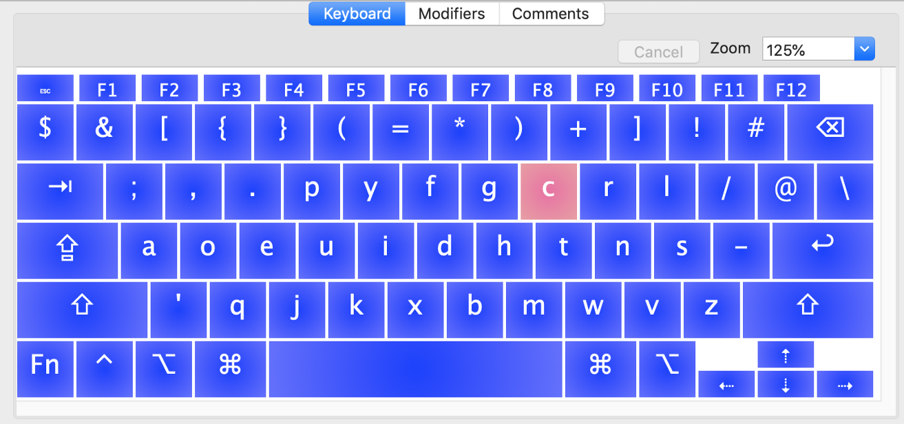
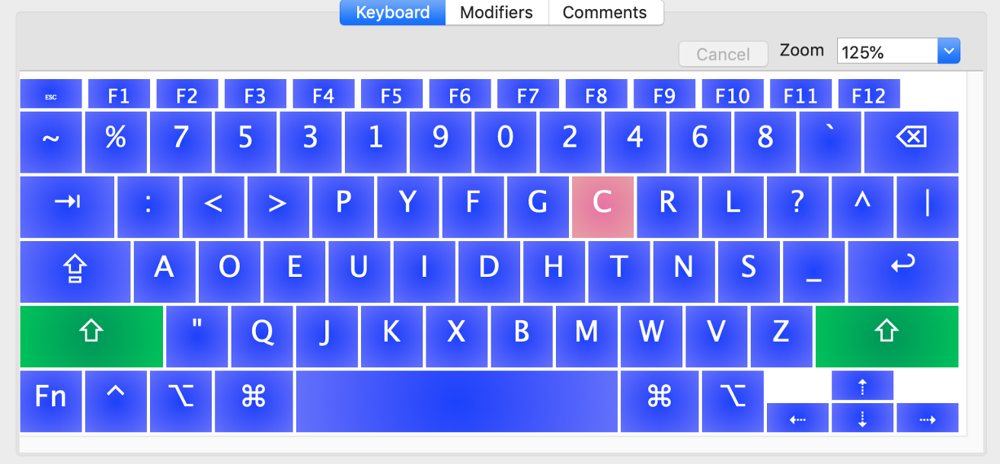
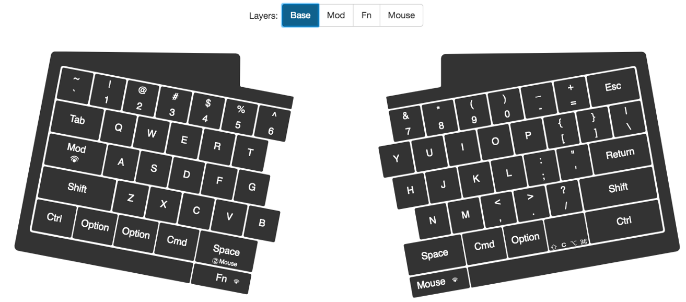
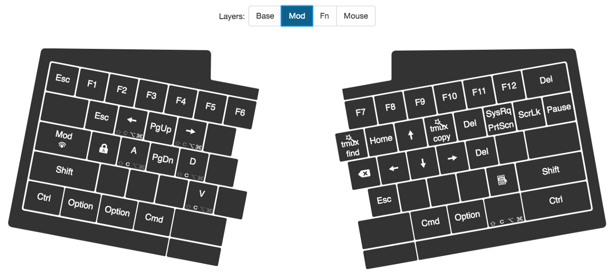
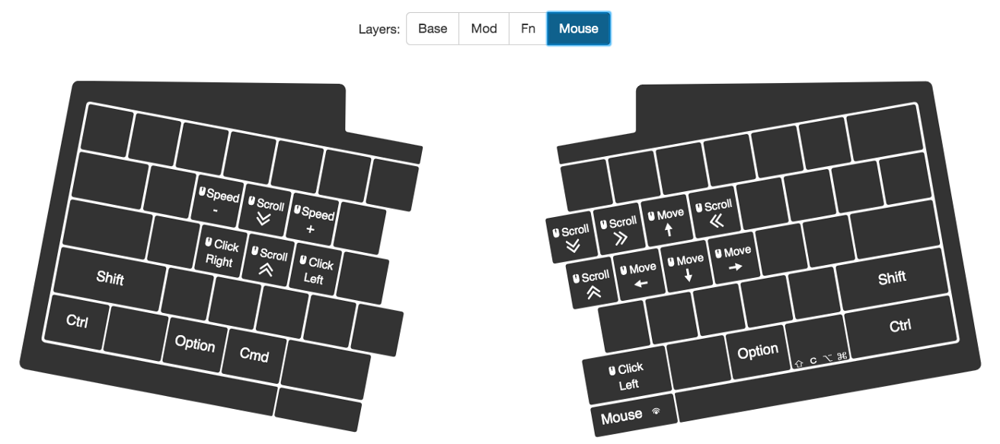
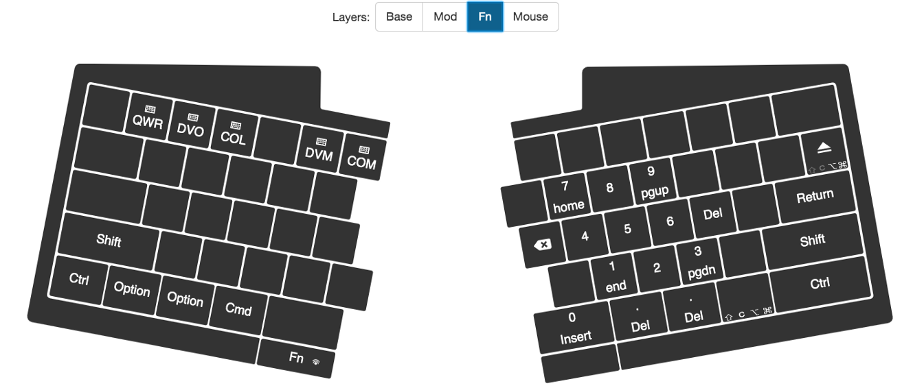

# Goodbye Karabiner-Elements, Hello Ultimate Hacking Keyboard!

## UHK

Ultimate Hacking Keyboard is a crowd-funded project started by Ultimate Gadget Laboratories, based in Hungary. There's an awful lot of reviews out there on the Internet already, but yet I thought this one may be useful for somebody.

_(Just one of the possible UHK variations. Visit https://ultimatehackingkeyboard.com/ for more. Image by Ultimate Gadget Laboratories)_

Just briefly and for introduction purposes, it's a truly split 60% mechanical keyboard that can also be un-split; (nearly) fully programmable, gorgeous-looking and sturdy built. Again, you can easily find a lot of info on specs on the Internet.

When I've found about this project back in 2016, I was really looking forward to it - though I couldn't really back it at that time. The price bites (about 420 euros for keyboard, palm rest and delivery, inside EU), so I was happy when I could finally afford it. The timing couldn't be better - my trusty full-sized 10-years-old Razer BlackWidow (I believe it's now discontinued, you can visit https://deskthority.net/wiki/Razer_BlackWidow to get the idea - I have the very first edition), started to double-type a key. Irritating! I never used Backspace as much.

First about hardware itself: it's really sturdy built; it feels and looks really cool; my version features Kailh Blues which are Cherry MX Blues clones, although they feel almost the same, and I actually like Kailh version a little bit better. The keyboard also features two additional buttons that are really mouse-like microswitches (below Mod and Space keys in the bottom row) - and they require a lot, a lot of force to press. I've found impractical to use those as layer modifiers that are used often, but they're still okayish for occasional use. Palm rests are great - thick, warm wood on top of a steel plate, very comfortable. It seems they won't wear out for a really long time. And UHK supports tenting, yay! It's so comfortable, don't even get me started. Although the plastic legs which help with tilting/tenting feel so cheap that I'm afraid they're gonna stop locking in place after a hundred retractions or so. And by the way I'm all with 6 on the left side - I was (self-)taught this way, although I've seen different opinions on the Web.

## My setup

A little bit about my keyboard setup - not only I use Karabiner-Elements with about 10 complex modifications, but also I use my own Dvorak variation based on Programmer Dvorak (https://www.kaufmann.no/roland/dvorak/) that's optimised for coding (for instance, it has a lot of special symbols on the number row, the numbers themselves are pressed with shift, odds with left hand, evens with right). For implementing that, I have a custom-built keyboard layout for Mac OS X, built with Ukelele (https://software.sil.org/ukelele/). Here are some images to give you the idea:

_Normal operation_

_Shift pressed_

If you'd like, you can download it, along with another layout optimised for Russian language, here: https://github.com/trueneu/truedv-osx-layout-en-ru.

This setup is complicated already, and I was hoping that UHK will help me to simplify it a little bit. And it did!

## UHK setup

As of now, there are three additional layers available - so called Mod, Fn and Mouse. Mod does Function keys, which are physically absent on the keyboard, and navigation; Fn does media keys; Mouse, well… you guessed it! There's also the Base layer, the default one. I tinkered a little bit with it as well, mainly changing modifiers and layer switchers around, so they fit my use-case better:

Luckily, I was using something resembling Mod layer very closely in Karabiner-Elements, using CapsLock as layer key, so it didn't take much time to adjust. You can find my config here: https://github.com/trueneu/dotfiles/blob/master/.config/karabiner/karabiner.json (By the way, to all those who say that using additional finger to press a modifier to navigate with arrow keys is cumbersome, I say - what's more cumbersome, to move your whole hand or to press a key?..)

As a matter of fact, the first thing I did when plugged in UHK was to disable all the complex modifications and recreated the keymap with UHK Agent. It's an easy-to-use application written with Node.js that allows to edit layouts, create new ones (all stored in keyboard's memory) and tweak various aspects of the board. (One can tinker with live demo @ http://ultimatehackingkeyboard.github.io/agent/#/keymap/QWR).

That's funny: even though UHK tries its best at helping hands to never leave the home row, Agent seems to be hardly controllable with keyboard only. Being able to control with mouse makes sense though: if you mess up your keyboard configuration badly, there probably won't be other options. The default configuration may be not comfortable for everyone out there, so I'd encourage you to play with it.

There's this option of secondary role that may be assigned to any key - when pressed alone, it acts as its primary role, but if you press another key at the same time, it switches to secondary. You can use Layer switchers or modifiers for secondary role. It may be useful, but I haven't found a use for it yet. One problem with this mode is that if you enable secondary role, the primary role triggers only when you depress the key (which is perfectly understable from the implementation point of view). However, it really messes up with hands-eye coordination as now the symbol appears on the screen not at the moment you expect it to. It may be okay with occasionally pressed keys, such as left space key as it turned out to be for me, but I guess it'll mess up more frequently used ones.

So, I left the Mod and Mouse layers more or less as they were:

_Mod Layer_

_Mouse Layer_

...but I ditched the Fn layer almost completely. Instead, I've programmed it to turn right-hand keys into Numpad - when you have a large number to type, it's PITA with Programmer Dvorak. Easy peasy!

_Fn Layer_

## Conclusion

Was I able to remove my OS custom keyboard layout completely? Not at all. UHK currently doesn't support modifiers as separate layers, so there's no way I can program key 1 to emit & when pressed alone, and % when pressed with Shift. It's probably gonna change sometime in the future (see https://github.com/UltimateHackingKeyboard/agent/issues/617 - no ETA given), but until then, I'm stuck with my uberly hacked shit.

Was I able to remove Karabiner-Elements layer for this keyboard? Yes - but because of the modifiers layers absence, I had to do some remapping. For example, I was using Ctrl+Command+Alt+Shift+F to emit F12, Ctrl+R sequence to trigger a search in tmux. To work around it, I recorded those as Macros and put them on Mod layer. Yeah, it changes the keys I have to press to invoke those, but it's not a big problem. Here I must say that a custom firmware is available (https://github.com/kareltucek/firmware) that introduces a much more powerful macros engine. I'm not a fan of using non-official built things - don't know what impact it'll have on performance, what bugs it does introduce, etc; although it should make my Karabiner-Elements configuration, as well as the keyboard layout, fully reproducable. If you feel like firmware-tinkering, that may be an option for you.

I was sceptical about Mouse layer at first, but it has proven to be very useful: sometimes it's really convenient not to move my hands away. It's perfectly usable, maybe not as fast as using real mouse, but for some tasks, such as editing presentation slides, I think I might like even better than the real thing.

I still miss some keys - I'm very used to narrow left Alt, for instance, and not used at all to change layers with my thumbs, only left pinky - but it seems to be hardwiring into my muscle memory as we speak. Not a big deal.

All in all, it's very comfortable to type on this keyboard. It is missing some features I'd like to see, but again - with UHK's Agent focus on simplicity it's really understandable. If one wants to really hack away, one builds something custom with QMK inside and does whatever one needs with C code. Me, I'm crazy about customization, but not that crazy.

Learning curve? Not steep, not steep at all. It's probably due to the fact that I'm already accustomed to all those weird customizations such as pressing CapsLock + 5 to get F5, or having Backspace mapped to Esc. People not using touch-typing will have major troubles when using UHK split, I assume.

So in conclusion, was it worth the price? Definitely. I'm already thinking of buying a second one for office in order not to carry another 1 Kg on my back every day.

It's probably a no-go for staggered layout haters, 60% haters, or really hardcore keyboard hackers/enthusiasts. I don't see why it won't work for anybody else :)
